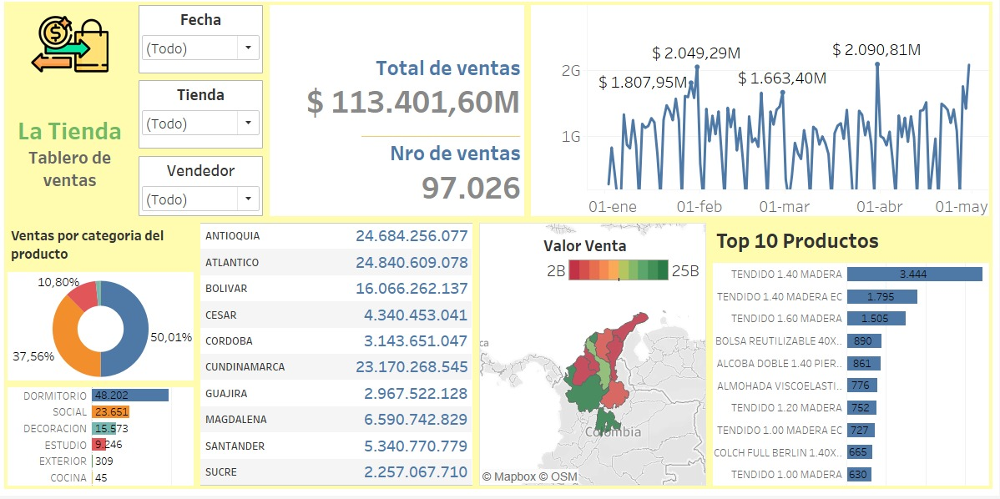

# 🛍️ La Tienda - Dashboard de Ventas

¡Bienvenido! Este repositorio presenta un dashboard interactivo diseñado en **Tableau**, con el objetivo de analizar las ventas por tienda, vendedor, producto y ubicación geográfica. 📊

---

## 📸 Vista del Dashboard

---

## 🔍 ¿Qué información muestra?

- 📅 **Filtros dinámicos:** por Fecha, Tienda y Vendedor  
- 💰 **Total de ventas:** $113.401,60M  
- 🧾 **Número de ventas:** 97.026  
- 📈 **Tendencia de ventas** a lo largo del tiempo  
- 🌍 **Distribución geográfica** por departamento (mapa de calor)
- 🛒 **Top 10 productos más vendidos**
- 🍩 **Categorías de productos** en gráfico de anillo

---

## 🎯 Objetivo

Facilitar la toma de decisiones comerciales con una visualización clara y efectiva de los principales indicadores de ventas de la empresa.

---

## 🛠️ Herramientas utilizadas

- **Tableau**
- **Excel** (para tratamiento previo de los datos)
